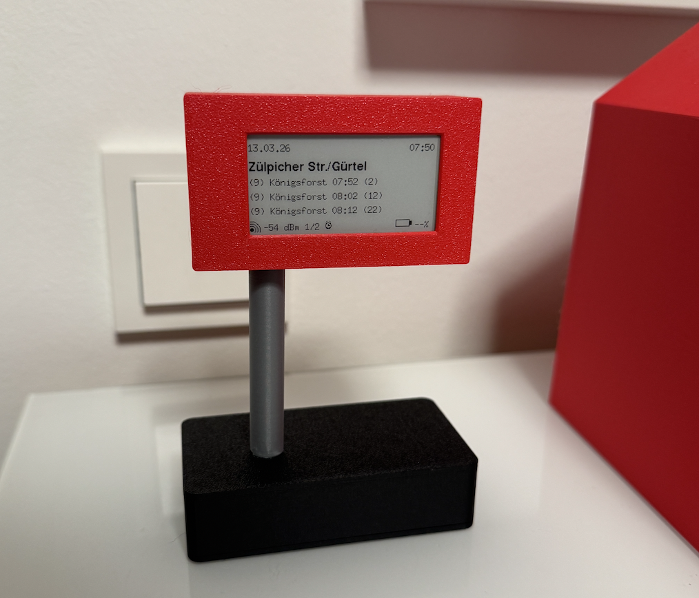
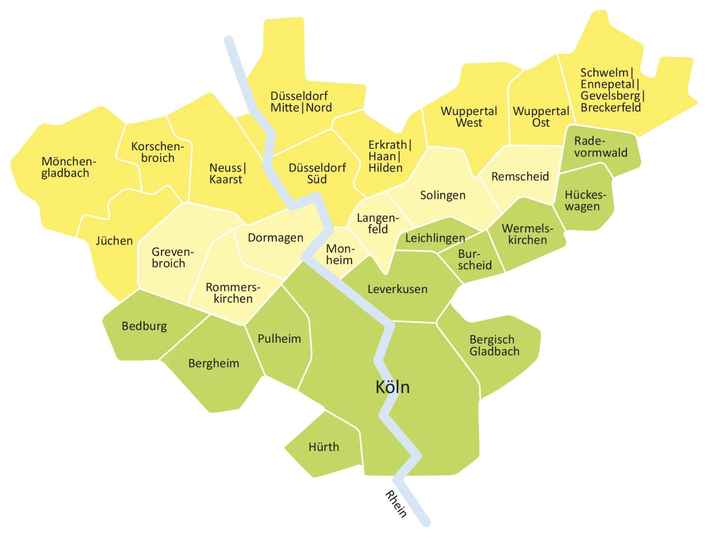

# ePaper VRS Departure Monitor

This project turns a small ESP32-based ePaper device into a dedicated public transit departure board for your home or desk. Instead of unlocking a phone, searching Google, or opening a transit app every time you want to check the next tram, bus, or train, the display shows the next departures at a glance with very low power consumption.



The firmware runs on an ESP32S3 embedded on the Seeed XIAO ePaper Display EE04 Board and fetches live departure information for up to four configured stops in the service area of the **VRS (Verkehrsverbund Rhein-Sieg)**.



## Disclaimer

This is an independent hobby project. It is **not** affiliated with, endorsed by, sponsored by, or maintained by **VRS (Verkehrsverbund Rhein-Sieg)** or any transport operator. All trademarks, names, and data sources belong to their respective owners.

## What Problem This Solves

Public transit information is usually easy to get, but inconvenient to check repeatedly throughout the day. In many households the actual need is simple:

- "When is the next departure from my stop?"
- "Do I need to leave now?"
- "Has the departure slipped by a few minutes?"

For that, a phone is often unnecessary friction. You have to pick it up, unlock it, search for the stop, or open the operator's app and wait for it to load. This project removes that friction by putting the next departures on a dedicated always-readable ePaper screen.

Typical use cases:

- In the hallway before leaving home
- On a desk while working
- In the kitchen during the morning routine
- Near the front door as a quick decision aid

## What It Does

- Creates a local setup Wi-Fi access point on first boot or when entering setup mode
- Lets you configure home Wi-Fi and up to 4 transit stops in the browser
- Shows the stop name, current time/date, signal quality, and the next departures
- Supports multiple power modes for always-on or battery-friendly usage
- Stores configuration in NVS and reuses Wi-Fi channel/BSSID hints for faster reconnects
- Uses the three hardware keys for station switching and mode changes

## Hardware

| Item | Qty | Price (March 26) | Notes |
| --- | ---: | --- | --- |
| Seeed Studio XIAO ePaper Display Board EE04 | 1 | ca. 12€ | Main board used by this project; includes the XIAO ESP32S3 and the ePaper driver hardware |
| Waveshare 2.9" Monochrome ePaper Display, 296 x 128 | 1 | ca. 9€ | The raw display panel only, used as the actual E-Ink screen rather than a complete controller module |
| 3.7 V LiPo battery, 3700 mAh | 1 | ca. 5€ | Example battery used in the build; other 1-cell LiPo capacities are possible if connector, size, and fit work for your enclosure |
| Battery extension cable | 1 | ca. 0,5€ | Used to connect the battery in the base to the board |
| 3D Printed Parts | 1 | ca. 2€ | 3D Printed Enclosure |

- Display
  - `BUSY`: `GPIO4`
  - `RST`: `GPIO38`
  - `DC`: `GPIO10`
  - `CS`: `GPIO44`
  - `SCK`: `GPIO7`
  - `MOSI`: `GPIO9`
- Keys
  - `KEY1` station button: `GPIO2`
  - `KEY2` setup key: `GPIO3`
  - `KEY3` sleep/normal mode key: `GPIO5`
- Battery sensing
  - `BAT_ADC`: `GPIO1`
  - `ADC_EN`: `GPIO6`

## Where The Departure Data Comes From

The live departure data shown on the display is derived from publicly reachable VRS departure monitor pages and endpoints.

The firmware accepts either of these URL patterns:

- `https://www.vrs.de/am/s/<hash>`
- `https://www.vrs.de/index.php?eID=tx_vrsinfo_departuremonitor&i=<hash>`

Internally, the firmware extracts the 32-character stop hash and normalizes it to the JSON-producing VRS departure monitor endpoint:

`https://www.vrs.de/index.php?eID=tx_vrsinfo_departuremonitor&i=<hash>`

In practice, that means:

1. You can paste a normal VRS stop/departure-monitor link into the setup UI.
2. The firmware extracts the stop identifier.
3. The device requests the corresponding departure monitor data over HTTPS.
4. The JSON response is parsed and the next departures are rendered on the ePaper display.

This project does **not** use an official SDK. It relies on the publicly accessible departure monitor endpoint currently used by the VRS website. If VRS changes that endpoint, response format, or access policy, this project may need updates.

## Features

- Browser-based setup UI served directly by the device
- Setup access point
- mDNS in setup mode via `http://mini.local`
- Wi-Fi network scan and credential storage
- Up to 4 configured stations/stops
- Live departure fetch over HTTPS
- Time display with regular NTP re-synchronization
- Signal strength indicator
- Battery percentage indicator
- Power mode icon in the footer
- Deep sleep support with multiple wake strategies
- Boot failure handling that forces setup mode after repeated Wi-Fi failures

## Device Controls

The EE04 hardware keys are used like this:

- `KEY1`
  - Normal mode: cycle through configured stations
  - Setup mode: leave setup mode and return to normal mode
- `KEY2`
  - Normal mode: enter setup mode
  - Setup mode: leave setup mode and return to normal mode
- `KEY3`
  - Normal mode: switch to normal/sleep mode
  - Setup mode: leave setup mode and return to normal mode

## Power Modes

- `Continuous`
  - Device stays active and refreshes periodically
- `SleepAlarm`
  - Device wakes at the configured interval
  - During the configured night window it can switch to a longer sleep period
- `SleepManual`
  - Device prefers long sleep
  - Manual interaction triggers a burst of shorter active refresh intervals

Current refresh interval range:

- Minimum: `20s`
- Maximum: `60s`
- Default: `40s`

Default night window:

- Start: `18:00`
- End: `09:00`

## Software Stack

- PlatformIO
- Arduino framework for ESP32
- `GxEPD2`
- `ArduinoJson`
- `U8g2`
- `U8g2_for_Adafruit_GFX`
- `QRCode`

PlatformIO environment:

- `seeed_xiao_esp32s3`

The setup UI is embedded into the firmware image and runtime configuration is stored in ESP32 NVS.

## Build And Flash

From the project root:

```bash
pio run
pio run -t upload
pio device monitor -b 115200
```

`platformio.ini` is currently configured for:

- `board = seeed_xiao_esp32s3`
- `board_build.partitions = partitions_ota_8mb.csv`
- native USB CDC enabled on boot

Because the partition table changed from the previous single-app layout, existing devices need one USB flash of this OTA-capable release before browser-based firmware updates will work.

## Local PlatformIO Overrides

The committed `platformio.ini` stays machine-neutral. If you want to pin a local serial port, copy `platformio.local.ini.example` to `platformio.local.ini` and edit it there.

Example:

```ini
[env:seeed_xiao_esp32s3]
upload_port = /dev/cu.usbmodem*
monitor_port = /dev/cu.usbmodem*
```

`platformio.local.ini` is loaded automatically and ignored by git.

## First-Time Setup

1. Flash the firmware.
2. Boot the device and enter setup mode if needed.
3. Connect your phone or laptop to the device AP:
   - SSID: `mini-config`
   - Password: `mini1234`
4. Open one of these URLs:
   - `http://mini.local`
   - `http://192.168.4.1`
5. In the setup UI:
   - select your home Wi-Fi
   - enter the Wi-Fi password
   - add one or more VRS station URLs
   - choose the power mode
   - choose the refresh interval
   - configure the optional night sleep window
6. Save the configuration.
7. Return the device to normal mode.

## Local API

The setup UI talks to a small local HTTP API on the device:

- `GET /api/config` read current configuration
- `POST /api/config` save Wi-Fi, stations, and power settings
- `POST /api/firmware` upload a new `firmware.bin` and reboot
- `GET /api/firmware/release` check the latest GitHub release and OTA eligibility
- `POST /api/firmware/release/install` download, verify, and install the latest GitHub release
- `POST /api/stations` save station list only
- `GET /api/scan` run or read Wi-Fi scan results
- `GET /api/status` read connection and signal state
- `POST /api/reboot` reboot the device
- `POST /api/factory_reset` clear configuration and reboot

## Web Firmware Update

Once a device is running this OTA-capable partition layout, the setup UI can update firmware in two ways:

- Upload a local `firmware.bin`
- Let the device install the latest published GitHub release

Manual upload workflow:

1. Update `VERSION` if needed.
2. Build the project with `pio run`.
3. Use `.pio/build/seeed_xiao_esp32s3/firmware.bin`.
4. Put the device into setup mode and open the setup UI.
5. Open the Settings card and upload that `firmware.bin`.
6. Wait for the automatic reboot and page reload.

Automatic GitHub release workflow:

1. Publish a GitHub release that contains a `.bin` firmware asset.
2. Put the device into setup mode and open the setup UI.
3. Make sure the device is connected to a Wi-Fi network with internet access.
4. Open the Settings card and click `Check for Update`.
5. If a newer release is available, click `Install Latest Release`.
6. The device downloads the asset from GitHub, verifies the SHA-256 digest from the release metadata, installs the update, and reboots.

Current limitations:

- Only the application image is updated. Upload `firmware.bin`, not `bootloader.bin` or `partitions.bin`.
- Firmware updates are only available while the device is in setup mode.
- Automatic installation only checks the latest published GitHub release.
- Automatic installation requires a `.bin` release asset with GitHub-provided `digest` metadata.
- Automatic installation is blocked when the installed firmware is already current or newer than the latest published release.
- The OTA slot size is currently `0x300000` bytes (3.0 MB). Larger images are rejected by the device.

## Stored Configuration

The firmware persists the following values in NVS:

- Wi-Fi SSID and password
- Configured stations
- Selected station index
- Power mode
- Update interval
- Night sleep start and end time
- Boot failure counter
- Last NTP synchronization timestamp
- Wi-Fi channel/BSSID fast-connect hints

## Notes

- Captive portal DNS support exists in the firmware but is currently disabled by default.
- `web/` is the source tree for the setup UI.
- `tools/build_web_assets.py` generates `include/generated_web_assets.h` before each build.
- `pio run` and `pio run -t upload` rebuild the embedded web assets automatically.
- The setup UI now supports both local OTA uploads and automatic installation of the latest GitHub release.

## License And Trademarks

The project code in this repository is licensed under the MIT License. See `LICENSE`.

The VRS name, logos, and any third-party brands or transit data remain the property of their respective owners. This repository does not grant trademark rights or claim ownership over those assets.
